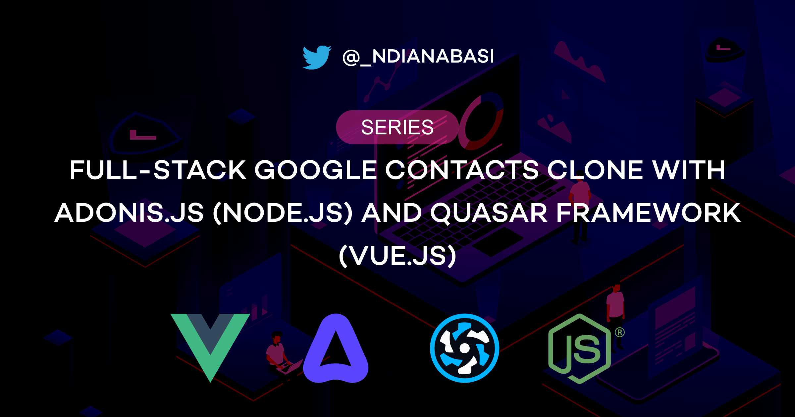

# Google Contacts Clone App for `Web Development Learning Series`

This repository holds the finished code for the Google Contacts Clone App developed for the Web Development Learning Series: [Complete Full-Stack Google Contacts Clone with Adonis.js/Node.js & Quasar/Vue.js](https://ndianabasi.com/technical-blog/series/clnwu9bc991hiu3wo2vwmw45/full-stack-google-contacts-clone-with-node-js-adonisjs-framework-and-vue-js-quasar-framework).

The project is incrementally developed to match each lesson in the series. It has different branches which correspond to different lessons within the series. So, you can easily go back in time and see the evolution of the app by checking out different branches.

If you want to learn via the series, you should not clone this project as it contains finished code. Rather, clone [this starter project](https://github.com/ndianabasi/google-contacts-clone-starter). However, if you want to study the code on your own and learn how the backend and frontend codes were developed, feel free to peruse this repository.

## Setup

You will find more instructions about how to setup your frontend environment for the series in this lesson: [Workspace Setup](https://ndianabasi.com/technical-blog/article/fo8str8yjpkz5dygxg875bpw/workspace-setup-full-stack-google-contacts-clone-with-adonis-js-node-js-and-quasar-vue-js).

You will find more instructions about how to setup your backend environment for the series in this lessons: [Setting Up The Backend](https://ndianabasi.com/technical-blog/article/fxb49fmz9ljbwrimbnnzudfv/setting-up-the-backend-full-stack-google-contacts-clone-with-adonis-js-node-js-and-quasar-framework-vue-js) and [Setting Up Our API Server with AdonisJs Framework](https://ndianabasi.com/technical-blog/article/x1jgmet84aqj9qggu5mulkh0/setting-up-our-api-server-with-adonis-js-framework-full-stack-google-contacts-clone-with-adonis-js-node-js-and-quasar-framework-vue-js)

## Support

You can find me on [Twitter](https://twitter.com/_ndianabasi).
